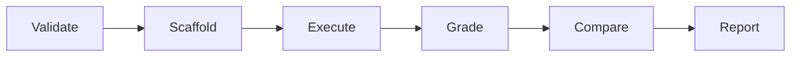

# Eval lifecycle

How `trg ai skills eval` moves from a skill manifest to a report bundle, what
artifacts exist at each stage, and where the implementation diverges from the
[agentskills.io](https://agentskills.io) eval specification.

## Overview

Skill evals answer one question: **does loading this skill make the agent
perform better on representative tasks?** The lifecycle has four phases:



On `yordis/eval-2`, **Validate**, **Scaffold**, and **Execute** are
implemented. **Grade** and **Compare** are implemented as standalone commands
(`eval grade`, `eval compare`); `eval run` can chain grading and benchmark
aggregation via `--grade` and `--benchmark`. **Report** aggregation is partial:
`benchmark.json` and `iteration_summary` are written and merged into the bundle,
but compare, feedback, and a single end-to-end report step remain separate.

## Phase 1: Validate

Triggered at the start of `eval run`.

1. **Skill validation** — `SKILL.md` frontmatter (`name`, `description`) must
   parse and satisfy Agent Skills conventions.
2. **Eval suite validation** — `evals/evals.json` is parsed with
   `deny_unknown_fields`. Checks include:
   - `skill_name` matches frontmatter `name`
   - At least one eval case with unique IDs
   - `files` paths exist and stay inside the skill directory

Validation is fail-fast: any error exits with code 1 before writing artifacts.

## Phase 2: Scaffold

After validation, `build_report_bundle` constructs `report.json` and creates
the directory tree:

```text
<out-dir>/<skill_name>/<report_id>/
├── report.json
├── runs/run-NNN/workspace/    (canonical; one per eval × scenario)
└── iteration-<N>/             (docs-compatible alias layer)
    ├── alias-index.json       (eval slug → run path mapping)
    ├── benchmark.json         (populated by `eval benchmark` or `eval run --benchmark`)
    └── eval-<slug>/<scenario>/  (symlink → runs/run-NNN/workspace)
```

Canonical run outputs live under `runs/run-NNN/workspace`. The
`iteration-<N>/` tree mirrors the [agentskills.io](https://agentskills.io)
layout as a **presentation layer only**: scenario directories are symlinks
back to the canonical workspaces so artifacts are not duplicated. When the
symlink call fails (e.g. read-only filesystem), the leaf gets a
`.workspace-ref` JSON file and the run still succeeds —
`alias-index.json` records the mapping either way.

`alias-index.json` maps each `eval-<slug>` to scenario run directories:

```json
{
  "eval-case-a": {
    "with_skill": "runs/run-001",
    "without_skill": "runs/run-002"
  }
}
```

With `--attempts` > 1, each scenario nests attempts under
`eval-<slug>/<scenario>/attempt-K/` and the index uses per-attempt keys
(`attempt-1`, `attempt-2`, …).

Each run record starts with:

- `status: "skipped"`
- Empty `artifacts` and `metrics`
- A workspace directory (initially empty)

The report captures **dimensions** — eval cases, assertions, scenarios, model
config label, and skill revision hash — so downstream graders and comparators
have stable IDs to reference.

### Run ordering

Runs are numbered sequentially: for each eval case (in manifest order), for
each scenario (in `--scenario` flag order). Two eval cases with
`with_skill` + `without_skill` produce runs 001–004.

## Phase 3: Execute

When `--runner` is provided, the CLI invokes the agent for each run:

| Step | What happens |
| ---- | ------------ |
| Prepare workspace | Stage fixtures; stage skill to `.skill/` or `.old-skill/` via symlink (default) or copy (`--skill-staging`) |
| Build prompt | Task + fixture paths + frontmatter summary + output constraints (`prompt` contract v1) |
| Invoke runner | Spawn `cursor-agent`, `claude`, or `codex` with stream-json output |
| Capture output | Write `transcript.jsonl`, `timing.json`; update run status and metrics |
| Integrity check | Hash skill files before/after; record tampering in `skill_integrity` |

Run terminal statuses:

| Status | Meaning |
| ------ | ------- |
| `skipped` | No runner configured (scaffold only) |
| `completed` | Runner exited successfully with a result event |
| `failed` | Spawn error, missing result event, or non-zero exit |

After all runs, summaries are rebuilt and `report.json` is rewritten in place.

## Phase 4: Grade

> **Status: implemented** — `eval grade` and `eval run --grade` write
> `grading.json` per run and merge `assertion_results` into `report.json`.
> Default `--grader auto` applies mechanical checks; assertions with no
> mechanical pattern are marked `needs_llm` until re-run with `--grader llm`
> or `--grader script`.

Flow:

1. For each completed run, graders inspect the workspace against assertions.
2. Mechanical graders (auto mode), script graders (`--grader script`), and LLM
   graders (`--grader llm`) produce `grading.json`.
3. Results merge into `report.json` `assertion_results`.
4. Optional `feedback.json` via `eval feedback init` for human review notes.

## Phase 5: Compare

> **Status: implemented** — `eval compare` pairs runs that share an eval case but
> differ by scenario, runs blind A/B judging with `--judge script` or
> `--judge llm`, and merges records into `report.json` `comparisons`. Use
> `--emit-comparison-json` for standalone per-case files. Requires `--pair` and
> `--judge script` or `--judge llm`; default `--judge none` is a no-op.

Flow:

1. Pair runs sharing the same eval case but different scenarios
   (`--pair with_skill:without_skill`, etc.).
2. Shuffle outputs into blind labels A/B per eval case.
3. Script or LLM judge picks a winner (or tie) with evidence.
4. Write comparison records into `report.json` (and optionally
   `comparison.json` per eval case).

## Phase 6: Report

The final `report.json` is the single source of truth for a eval session.
Consumers include CI gates, dashboards, and human reviewers.

Available today:

- Suite hashes (reproducibility)
- Run records with metrics and transcripts
- Per-scenario completion summaries
- CI context (GitHub Actions)
- `assertion_results` after `eval grade` or `eval run --grade`
- `comparisons` after `eval compare` with a judge
- `benchmark.json` and `iteration_summary` after `eval benchmark` or
  `eval run --benchmark`

Partial / separate steps:

- `eval compare` and `eval iteration-summary` are not chained by `eval run`
- `feedback.json` via `eval feedback` (init/list/validate), not auto-written
- LLM grading for non-mechanical assertions requires `--grader llm`

---

## Artifact model

Artifacts fall into three tiers:

```text
report.json          ← session-level index (always written)
├── runs/run-NNN/
│   ├── workspace/   ← agent outputs + staged fixtures
│   ├── transcript.jsonl  ← runner stdout
│   ├── timing.json       ← run metrics
│   └── grading.json      ← grader output from `eval grade`
├── benchmark.json   ← cross-run aggregates from `eval benchmark`
└── comparison.json  ← per-case scenario deltas (optional; `eval compare --emit-comparison-json`)
```

| Artifact | Writer | Reader |
| -------- | ------ | ------ |
| `report.json` | `eval run` | Humans, CI, dashboards |
| `transcript.jsonl` | Runner | Debugging, future LLM graders |
| `timing.json` | Runner | Verify, benchmarks |
| `grading.json` | `eval grade` | `eval verify`, report merge |
| `feedback.json` | `eval feedback init` | Human review |
| `benchmark.json` | `eval benchmark` | CI trend tracking |
| `comparison.json` | `eval compare` (optional) | A/B analysis |

---

## Iteration flow

Typical skill author loop:

1. **Write eval cases** — add prompts, fixtures, and assertions to
   `evals/evals.json`.
2. **Scaffold** — `eval run` without `--runner` to validate structure cheaply.
3. **Execute** — `eval run --runner cursor-agent` to get agent outputs.
4. **Grade** — `eval grade` or `eval run --grade`; then `eval verify --mode strict`.
5. **Iterate skill** — edit `SKILL.md`, re-run from step 2.
6. **Compare** — `eval compare --pair with_skill:without_skill --judge script` (or `--judge llm`).
7. **CI** — wire run, grade, and benchmark into a pipeline on every PR.

Each iteration produces a new `<report_id>` directory. Hashes in `report.json`
let you detect when the skill or eval suite changed between runs.

---

## Divergences from agentskills.io

The [agentskills.io evaluating-skills guide](https://agentskills.io/skill-creation/evaluating-skills)
defines a portable eval format. `trg` follows the manifest and companion
artifact shapes but differs in workspace layout, `report.json` as a superset
index, CLI workflow, and several policy defaults.

| Topic | agentskills.io | `trg` on `yordis/eval-2` |
| ----- | -------------- | ------------------------ |
| Report schema | Spec-defined report format | Custom `trg.skills-eval.report.v1` schema |
| Scenario names | `with_skill`, `without_skill`, `with_old_skill` | `with_skill`, `without_skill`, `old_skill` (no `with_` prefix on old) |
| Old skill execution | Supported | Supported with `--old-skill-dir` when `--scenario old_skill` is included |
| Grading | LLM + mechanical graders in pipeline | `eval grade` / `--grade`; mechanical + script + LLM modes |
| `benchmark.json` | Defined in spec | Emitted by `eval benchmark` or `eval run --benchmark` |
| `feedback.json` | Defined in spec | Scaffolded via `eval feedback init`; not auto-written |
| `comparison.json` | Standalone comparison records | Optional via `eval compare --emit-comparison-json`; `comparisons` also merged into `report.json` |
| Model config capture | Full parameter capture | `capture_status: "partial"`; label only |
| Skill staging | Spec-defined layout | Symlink to `.skill/` (default) or copy with `--skill-staging copy` |
| Docs layout aliases | Primary tree under `iteration-N/` | Canonical `runs/run-NNN/` plus symlink mirror and `alias-index.json` |
| Skill integrity | Not in spec | SHA-256 before/after tamper detection |
| CI metadata | Not in spec | Auto-captured from GitHub Actions env vars |
| Runners | Spec-agnostic | Concrete adapters for cursor-agent, claude, codex |
| Transcript format | Spec-defined | Raw runner stream-json (runner-specific) |
| Eval ID type | String | String or non-negative integer |
| Assertion IDs | Spec-defined | `<eval-case-id>:a<index>` pattern |

These divergences are intentional staging points. As the pipeline converges
toward spec compatibility, `trg` retains extensions (integrity checks, CI
context, iteration aliases) that the spec does not cover.

---

## Prompt contract

Eval runner prompts follow `PROMPT_CONTRACT_VERSION` (`v1` in
`crates/trg/src/agentskills/prompt.rs`). Snapshot tests lock the exact wording
so benchmark comparisons stay repeatable across CLI releases.

### What every prompt includes

| Section | `with_skill` | `without_skill` | `old_skill` |
| ------- | ------------ | --------------- | ----------- |
| Task prompt (verbatim from `evals.json`) | yes | yes | yes |
| Input file paths (staged fixture relatives) | when listed | when listed | when listed |
| Skill path hint | `.skill/` | — | `.old-skill/` |
| Skill summary (frontmatter only) | current skill | — | old skill |
| Output constraints | yes | yes | yes |

Output constraints are always:

```text
Write all deliverable files under outputs/. Do not write files outside outputs/.
```

### Embedding `SKILL.md` in the prompt

**Decision:** do **not** embed the full `SKILL.md` body when the skill is already
symlinked into the run workspace. Runners can read the complete instructions from
the symlink; duplicating the body wastes tokens and makes prompts drift when the
file changes without updating the hash used for caching.

| Scenario | Workspace skill link | Prompt carries |
| -------- | -------------------- | -------------- |
| `with_skill` | Symlink or copy → `.skill/` | Frontmatter `name` + `description` only |
| `old_skill` | Symlink or copy → `.old-skill/` | Old skill frontmatter only |
| `without_skill` | No skill link | No skill lines at all |

Use `--skill-staging symlink` (default) to share the live skill directory with
the run workspace. Use `--skill-staging copy` when you need isolation from
mid-run edits to the source skill or to prevent symlink traversal outside the
skill tree (external symlinks in the skill are copied as links, not followed).
The chosen mode is recorded per run in `report.json` as `skill_staging`.

Baseline (`without_skill`) prompts must not mention skills, `.skill/`, or
`.old-skill/`. `old_skill` prompts must reference `.old-skill/` only and must not
mention the current skill revision.

---

## Related docs

- [Divergences from agentskills.io](divergences-from-agentskills-io.md)
- [Reference: flags and artifact schemas](../reference/ai-skills-eval.md)
- [How-to: run with current skill only](../how-to/run-current-skill-only.md)
- [How-to: compare with-skill vs baseline](../how-to/compare-with-skill-vs-baseline.md)
- [How-to: troubleshooting](../how-to/troubleshooting.md)
